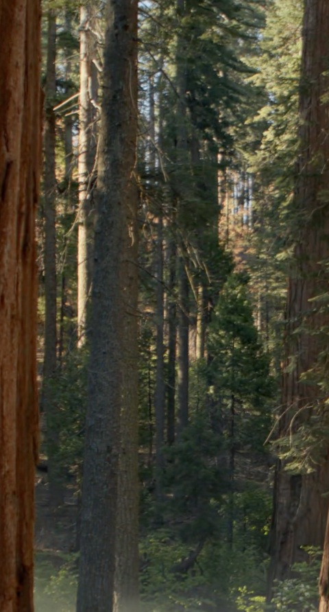

# OpenCV ile Yüz Algılama 🎯

Bu proje, **OpenCV** kullanarak gerçek zamanlı bir yüz algılama sistemi sunar.  
Orijinal olarak [Python for Developers Workshop](https://github.com/ahmetKaya00/Python-for-Developers-Workshop) kapsamında geliştirilmiş, daha sonra kişisel kullanım için uyarlanmıştır.

## 🚀 Özellikler

- Gerçek zamanlı kamera ile yüz algılama
- OpenCV'nin hazır Haar Cascade sınıflandırıcısını kullanır
- Basit, hafif ve kolay çalıştırılabilir

## 🖥️ Demo



## 📦 Gereksinimler

- Python 3.7 veya üzeri
- OpenCV kütüphanesi

Kurulum:

```bash
pip install opencv-python
